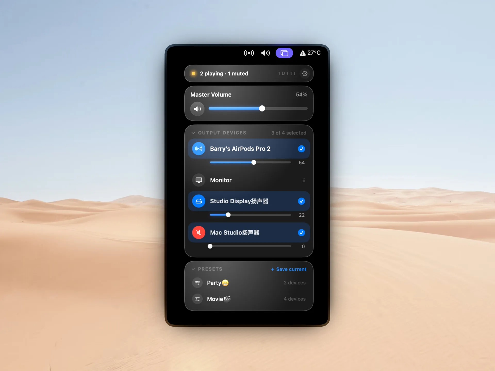

<p align="center">
  
</p>

<h1 align="center">Tutti</h1>

<p align="center"><em>One sound, every speaker.</em></p>

<p align="center">A macOS menu bar utility that plays the same audio through any number of output devices at once.</p>

<p align="center">
  <a href="https://github.com/BarryBarrywu/tutti/releases/latest/download/Tutti.dmg"><strong>Download for macOS</strong></a>
  ·
  <a href="https://github.com/BarryBarrywu/tutti/releases">All releases</a>
</p>

<p align="center">
  
  
  
  
</p>

<p align="center">
  
</p>

<!-- TODO screenshots:
  docs/screenshots/menubar.png  - menu bar icon, three states stacked (idle / playing / muted)
  docs/screenshots/settings.png - Settings -> License tab in activated state (scallop badge + key)
-->

## The volume icon macOS should have shipped

macOS gives you a slider, a device list, and a tiny speaker glyph. Tutti shows what's actually playing, on which devices, with per-device volume, mute state, and Bluetooth battery — so you can hide the system icon and let Tutti take its spot. First launch walks you through it: System Settings › Control Center › Sound › Don't Show in Menu Bar.

## Features

- **Multi-device output**: tick multiple outputs in the menu bar; Tutti creates an Aggregate Device on the fly and sets it as the system default.
- **Single-device passthrough**: pick just one and Tutti switches the system default directly, no virtual device created.
- **Master and per-device volume + mute**: one slider for everything, individual sliders and mute toggles for each output — silence one speaker while the rest keep playing.
- **Three-state status**: "playing on all", "partially muted", or "all muted", with synchronized text and color dot.
- **Volume takeover** (Pro): keyboard volume keys (F11 / F12 / mute) drive the aggregate output globally; the scroll wheel on the menu bar icon or popover does the same. Shift+Option fine-grain steps match the system. The keyboard path requires Accessibility permission; the scroll path doesn't.
- **Presets** (Pro): save your favorite device combinations as named presets and switch with one click from the menu bar.
- **Bluetooth headphone battery**: shown next to the device name when available.
- **Active AirPlay surfacing**: once macOS has routed audio to an AirPlay receiver, it appears in Tutti's device list as an `airplayaudio`-marked output, ready to be selected like any other device.
- **External change awareness**: switching the default output via System Settings or Control Center auto-destroys the Aggregate Device and updates the selection.
- **Orphan device cleanup**: cleans up Aggregate Devices left behind from a previous crash, plus legacy MultiOut residues, on launch.
- **Light / Dark / System** theme.
- **Launch at login** and **automatic update checks** via Sparkle.

## Use cases

- **Shared listening**: living room speaker plus Bluetooth headphones at the same time; your friend wears headphones while you play out loud.
- **Streaming, presenting, lecture recording**: monitor through headphones while broadcasting to an audience or a capture card.
- **Multi-room playback**: drive a pair of wired speakers in the living room and another in the bedroom from one Mac.
- **Collaborative monitoring**: share one Mac with two pairs of headphones plugged in.
- **Teaching**: teacher hears prompts in their headphones while the classroom speaker plays for students.

## Playback sync

When you select multiple outputs, Tutti combines them into one synchronized group with clock-drift correction turned on, so the devices stay in step instead of slowly sliding out of phase. macOS also compensates for the wireless latency of Bluetooth, so a wired speaker and a Bluetooth speaker playing together stay aligned with no noticeable echo.

AirPlay is the exception: macOS does not allow AirPlay receivers (HomePod, AirPlay speakers, Apple TV) to be combined with other devices in a multi-output group, so an AirPlay device can only be used on its own. This is a system-level restriction that applies to every third-party app, not just Tutti — see the [Roadmap](#roadmap) for where AirPlay support is headed.

## Tutti Pro

Every new install gets a **7-day Pro trial** on first launch, no license key required. After the trial, all free-tier features keep working without limits.

Pro lets you adjust volume without opening Tutti, and save device combinations as presets for one-tap switching:

- **Keyboard volume keys** (F11 / F12 / mute) drive the aggregate output globally. Shift+Option fine-grain steps match the system.
- **Scroll wheel** on the menu bar icon or inside the popover panel does the same.
- **Presets**: save the speaker combinations you use most and switch with one click from the menu bar.

- **$7.99 one-time**, no subscription.
- **Up to 2 Macs** per license. Activate and deactivate from Settings -> License.
- **All future Pro features included** at no extra cost.
- **14-day refund**, no questions asked — just email support@barrybarrywu.com.

[Get a Tutti Pro license](https://checkout.dodopayments.com/buy/pdt_0NfolyiommnaLUYQ5aPqn)

## Roadmap

A glimpse of where we'd like Tutti to go. Timing depends on what macOS opens up to third-party apps, so no promised dates.

- **AirPlay routing inside Tutti**: today, Tutti shows an AirPlay receiver in its device list *after* macOS has already routed audio to it. The missing piece is starting and switching that route from inside Tutti — picking HomePods, Apple TVs and other AirPlay receivers straight from the panel, without first going to Control Center. macOS keeps AirPlay discovery and switching on a first-party-only track, so for now Control Center handles that initial route. The moment that opens up, Tutti will too.

## Non-goals

Tutti deliberately does **one** thing: send the same sound to several output devices at once, with no driver and no trace left behind.

It will not grow into a per-app mixer. Per-app volume, per-app routing, and a system EQ all require a virtual audio driver / Audio Server plugin running in the background — incompatible with Tutti's driver-free, leave-no-trace design and its macOS 13 baseline. The name says it too: *tutti* means everyone playing together, one sound everywhere, not each app on its own.

If you need per-app control or an equalizer, [SoundSource](https://rogueamoeba.com/soundsource/) (paid) and [FineTune](https://github.com/ronitsingh10/FineTune) (free, open source) are built for exactly that.

## Localization

Localized in 9 languages: Simplified Chinese, Traditional Chinese, English, Japanese, Korean, French, German, Italian, Spanish.

## Requirements

- macOS 13.0 or later
- Accessibility permission, only when you use the Pro keyboard volume key takeover (scroll path doesn't need it)

## Build

```bash
brew install xcodegen
cd tutti
xcodegen generate
xcodebuild -project Tutti.xcodeproj -scheme Tutti build
```

## License

Tutti ships under a Source-Available model rather than traditional Open Source, licensed under [PolyForm Noncommercial License 1.0.0](https://polyformproject.org/licenses/noncommercial/1.0.0).

Anyone can download, compile, and use Tutti for personal, non-commercial purposes free of charge.

> **For developers**: you're welcome to clone this repo and build it yourself. Per the PolyForm license, you may not use this code or any modified version for commercial gain, including shipping it on an app store or bundling it into a paid service.
